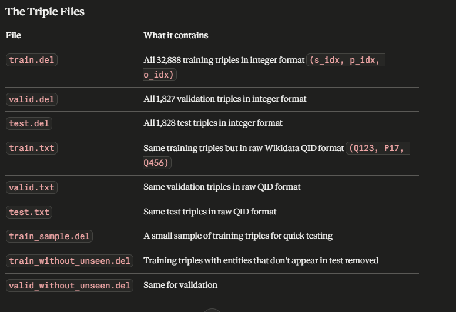
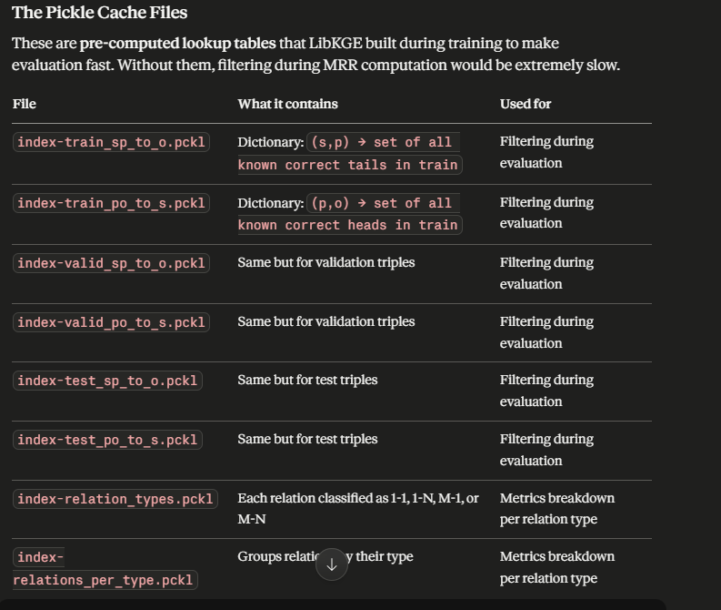
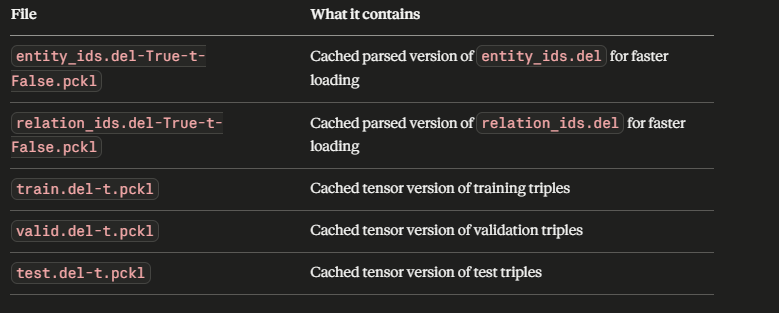

# Model Files

## winner_model.pt
The actual trained ComplEx model.  
Contains the learned embedding vectors for all **2034 entities** and **42 relations**.  

This is the brain — everything else just helps you use it correctly.

---

## ID Mapping Files

These are the most critical files after the model itself.  

LibKGE assigns every entity and relation an integer index during preprocessing.  
These files map those indices to Wikidata IDs.

- `entity_ids.delindex` → Maps entity index to Wikidata QID  
  Example:
  0 Q100
  - `relation_ids.delindex` → Maps relation index to Wikidata PID  
Example:
0 P17

Without these, an index like `0` in the embedding matrix means nothing.  
With them, we know exactly what that index represents.

---

## Triple Files

These contain the knowledge graph triples used for training and evaluation.

---

## Pickle Files

Serialized files used during training/inference.

---

## Precomputed Pickle Lookups

Precomputed lookup structures for faster inference.
