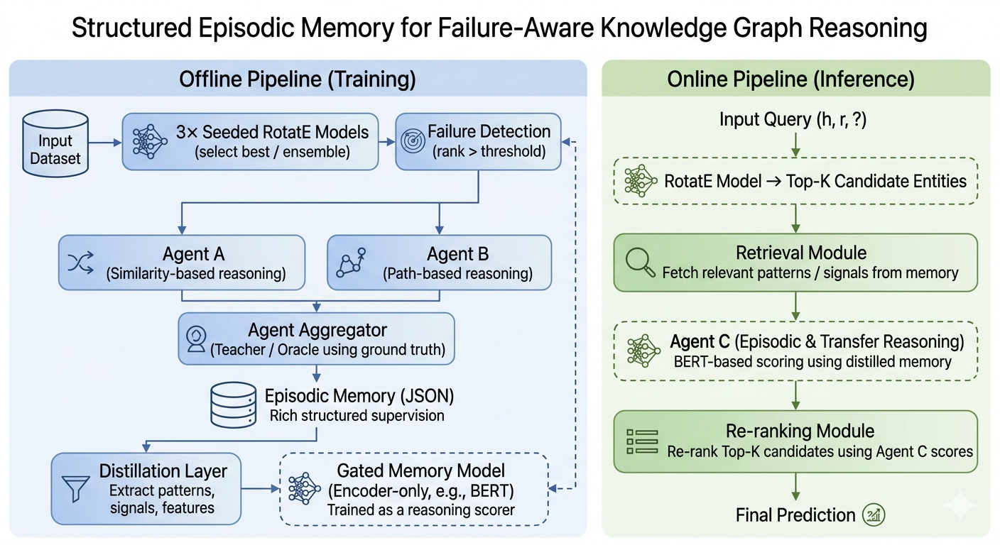
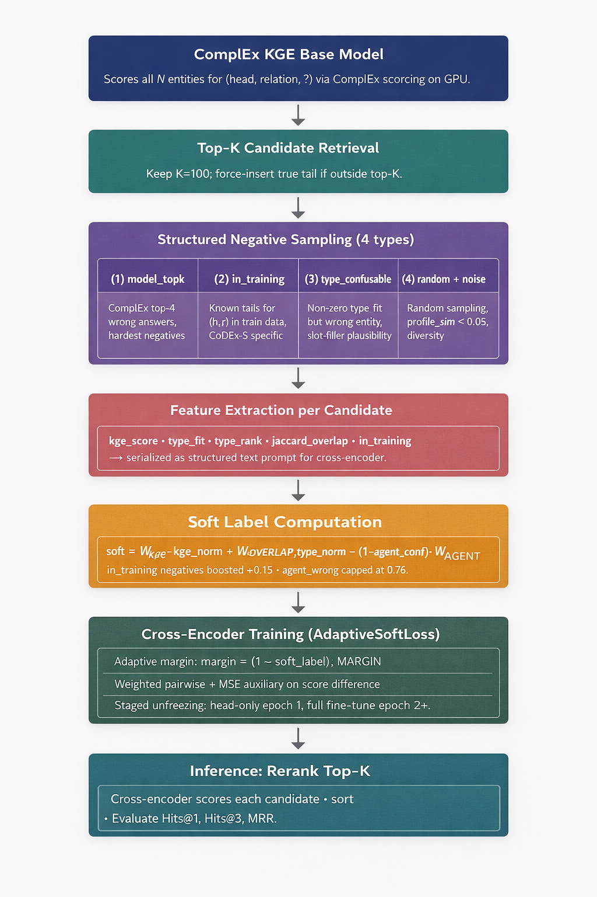
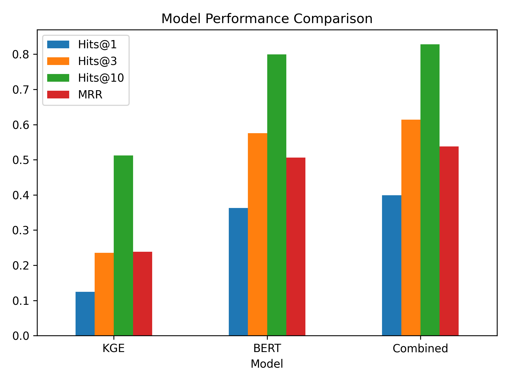
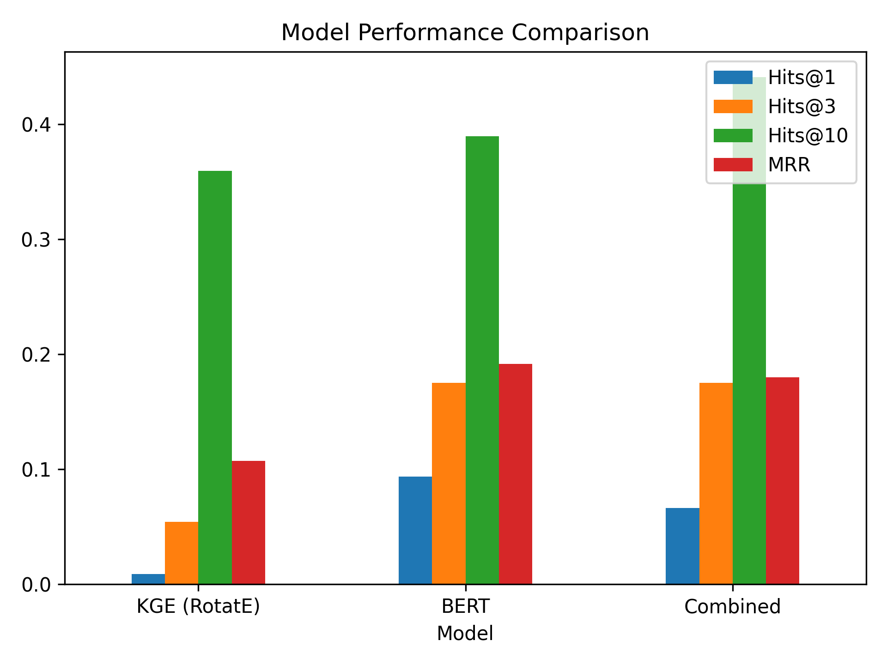

# Heterogeneous Memory Augmented Reasoning for Knowledge Graph Completion

> **Course Project** — Natural Language Processing with Deep Learning  

> **Contributors** — Aarya Upadhya (Aarya.upadhya@gmail.com) , Anshull M Udyavar (anshullmudyavar@gmail.com)
---

## Table of Contents

1. [Overview](#overview)
2. [Core Hypothesis](#core-hypothesis)
3. [What Makes This Unique](#what-makes-this-unique)
4. [Repository Structure](#repository-structure)
5. [Datasets](#datasets)
6. [Architecture](#architecture)
   - [Training Pipeline](#training-pipeline)
   - [Inference Pipeline](#inference-pipeline)
7. [Evaluation Metrics](#evaluation-metrics)
8. [Results](#results)
   - [CODEX-S](#codex-s-results)
   - [UMLS](#umls-results)
9. [Key Findings](#key-findings)
10. [Limitations & Future Work](#limitations--future-work)

---

## Overview

Knowledge Graph Embedding (KGE) models such as RotatE and ComplEx fail silently on a class of triples called **Hard Triples** — they rank the wrong answer and propagate the error with no mechanism to detect or learn from the failure.

This project introduces a **memory-augmented multi-agent framework** that:

- Diagnoses KGE failures using a structured agentic layer
- Accumulates validated reasoning experience via **episodic memory writeback**
- Recovers **98.5% of hard triples** where RotatE achieves 0.0 Hits@1
- Operates **without retraining, without API dependence, and without modifying model weights** during inference

---

## Core Hypothesis

> *"Can a richer schema from Teacher-Student based distillation reasoning on top of KGE prior solve Hard Triples?"*

The central insight is that KGE failure is not just noise — it is a **diagnostic signal**. Instead of trying to patch the embedding model, this work builds a reasoning layer that treats the failure mode as its primary input.

---

## What Makes This Unique

### 1. KGE Failure as a Reasoning Signal, Not a Training Signal
Every prior approach to improving KGEs either retrains or augments the embedding model itself. This work treats ComplEx as a **fixed diagnostic oracle**. When it fails, an agentic layer reasons about *why* the geometry failed for that specific query — what structural property of the graph the embedding space could not capture — rather than simply predicting a better answer. **The failure mode becomes the input, not the loss.**

### 2. Quality-Gated Writeback, Not Static Retrieval
Standard RAG systems retrieve from a fixed document store. This system writes back to episodic memory **only when reasoning is validated**. A prediction that is correct but ungrounded (high confidence, low reasoning quality — the "lucky rate" diagnostic) is explicitly penalized and not stored. Memory grows only from wins the system genuinely understood.

### 3. Grounded Scoring as a Process Reward Model
During training, a grounded scorer uses the known correct answer to identify which relations in the graph actually separate the true tail from the predicted one. This is structurally identical to **Process Reward Models (PRM) in RLHF**, where each reasoning step is evaluated with access to the ground truth rather than only the final outcome. The novelty is applying this step-level grounding to relational path discrimination in a knowledge graph.

### 4. Episodic Memory Satisfying DeChant's Four Safety Principles — Plus a Fifth
DeChant (2025) independently identified four necessary properties for safe episodic memory in AI agents:
- Interpretability
- User controllability without retraining
- Detachability from model weights
- Prevention of agent self-editing of past records

This system satisfies all four as **emergent architectural properties**, not post-hoc additions — the memory is structured JSON, fully inspectable, detached from KGE weights, and write-protected from the agents themselves.

Beyond DeChant, this work identifies a **fifth risk specific to continual learning: Memory Ossification**, where early low-quality episodes anchor and distort all future reasoning. This is addressed through quality-gated writeback and plateau-triggered memory auditing, neither of which appears in prior episodic memory literature.

---

## Repository Structure

```
.
├── Benchmark/
│   └── CodexS/              # Codex-S results, evaluation and setup
├── Config/                  # Configuration files for CODEX-S evaluation
├── Data/                    # Dataset files (Kaggle upload explained in README)
├── Docs/                    # Documentation and notes
├── Evaluation_Metrics/      # Evaluation of UMLS and CODEX-S results
├── Extra/                   # Auxiliary scripts and experiments
├── Images/                  # Architecture diagrams and figures
├── Main/
│   └── Inference/           # BERT distillation and inference model setup
├── Models/                  # Trained models and NLG language translation for LLM
├── Notebooks/               # Jupyter notebooks (UMLS pipeline)
├── Old_Hypothesis_Runs/     # Previous experimental runs
├── res/                     # Results and evaluation outputs
├── .gitignore
├── LICENSE
└── README.md
```

---

## Datasets

### 1. UMLS
- **Type:** Closed-world dataset developed at the University of Missouri–St. Louis
- **Purpose:** Small-scale model validation and baseline comparison
- A compact medical ontology graph — useful for rapid iteration and sanity checks before scaling

### 2. CODEX-S
- **Type:** Modern benchmark for Knowledge Graph Completion
- **Source:** Extracted from Wikipedia + Wikidata
- **Statistics:**
  - 2,304 test triples
  - 42 distinct relation types
  - 36,000+ total triples
- **Capabilities:** Supports both Link Prediction and Triple Classification tasks

---

## Architecture

### Training Pipeline



The offline training pipeline consists of five stages:

**Stage 1 — KGE Failure Detector**
ComplEx and RotatE are run on all candidate entities. Triples where both models rank the correct tail above a confidence threshold are classified as hard failures and become the primary input to the agentic layer. Three seeded runs are performed per model for robustness.

**Stage 2 — Structured Failure Context Builder**
For each hard failure, a structured context is created by:
- Extracting the local subgraph around the failed query
- Separating similarity signals from path signals
- Profiling the failure by hop type and structural category

This context is injected as a natural-language prompt using a **ReAct-based prompting network** with context engineering. The framework consists of **Agent A** (similarity-based reasoning), **Agent B** (path-based reasoning), and an **Agent Aggregator**.

**Stage 3 — Grounded Scorer and Aggregator**
The aggregator acts as a teacher oracle with access to ground truth. It performs post-hoc analysis of each agent's reasoning path, distilling the correct relational reasoning into a structured JSON episodic memory entry. The ground score determines which agent's reasoning is saved.

**Stage 4 — Distillation**
The model output feeds two tasks:
- Richer natural language reasoning traces for each hard triple
- Meta-reasoning about which agent solved the hard problem and why

**Stage 5 — Gated Memory Model**
Patterns and signals extracted from the distillation layer are used to train a BERT-based encoder (gated memory model) as a reasoning scorer. The encoder is trained as an encoder-only model using the distilled episodic memory.

> **LLM backbone:** Qwen 7B Instruct (Agent A + B + Aggregator)

---

### Inference Pipeline



The online inference pipeline re-ranks KGE candidates using the distilled memory:

**Stage 1 — KGE Prior**
ComplEx / RotatE scores all N entities for the query `(h, r, ?)` and returns the Top-K candidate entities. K = 100, with the true tail force-inserted if it falls outside top-K.

**Stage 2 — Hard Negative Construction**
Structured negative sampling across four categories:
| Type | Description |
|---|---|
| `model_topk` | ComplEx top-K wrong answers (hardest negatives) |
| `in_training` | Known tails for `(h,r)` pairs in training data |
| `type_confusable` | Non-zero type fit but wrong entity; slot-filler plausible |
| `random + noise` | Random sampling with profile similarity < 0.05 |

**Stage 3 — Structured Feature Encoding**
Feature extraction per candidate:
```
kge_score · type_fit · type_rank · jaccard_overlap · in_training
→ serialized as structured text prompt for cross-encoder
```

**Stage 4 — Soft Label Computation**
Labels are computed as soft scores (not binary) to avoid memorization:
```
soft = W_kge · kge_norm + W_overlap · jaccard_type_norm + (1 − agent_conf) · W_agent
```
In-training negatives boosted +0.15; agent wrong capped at 0.76.

**Stage 5 — Cross-Encoder Training (AdaptiveSoftLoss)**
- **Adaptive margin:** `margin = (1 − soft_label) · MARGIN`
- **Weighted pairwise:** Pairwise + MSE auxiliary on score difference
- **Staged unfreezing:** Head-only epoch 1, full fine-tune epoch 2+

> **Re-ranking model:** `cross-encoder/ms-marco-MiniLM-L-6-v2`

**Stage 6 — Re-ranking**
Cross-encoder scores each candidate, sorts, and the top-ranked entity is the final prediction. Evaluated on Hits@1, Hits@3, MRR.

---

## Evaluation Metrics

### Hits@K (Ranking Accuracy)
Checks whether the correct answer appears in the top-K predictions:

$$\text{Hits@K} = \frac{1}{|Q|} \sum \mathbf{1}[\text{rank}(t^*) \leq K]$$

### Mean Reciprocal Rank (MRR)
Rewards higher-ranked correct answers more strongly:

$$\text{MRR} = \frac{1}{|Q|} \sum \frac{1}{\text{rank}(t^*)}$$

### Diagnostic Metric — Lucky Rate vs. Grounding Rate

A novel metric that goes beyond asking *whether* a prediction is correct to asking *why* it is correct.

Let $S$ = the set of queries where the combined model predicts rank = 1.

- **Grounded:** BERT's cross-encoder already ranked the correct answer in Top-T before KGE re-scoring
- **Lucky:** BERT ranked it low, but either parametric memory (in LLMs) or KGE scoring pushed it higher

$$\text{LuckyRate} = \frac{|S_{\text{lucky}}|}{|S|}, \quad \text{GroundRate} = \frac{|S_{\text{grounded}}|}{|S|}$$

$$\text{LuckyRate} + \text{GroundRate} = 1$$

A high Grounding Rate means the model's predictions are causally explained by the retrieved relational structure, not by chance alignment with parametric knowledge.

---

## Results

### CODEX-S Results



#### Main Performance Table

| Model | Hits@1 | Hits@3 | Hits@10 | MRR |
|---|---|---|---|---|
| KGE (RotatE) | 0.1247 | 0.2352 | 0.5120 | 0.2382 |
| BERT | 0.3632 | 0.5755 | 0.7998 | 0.5062 |
| **Combined** | **0.3993** | **0.6138** | **0.8282** | **0.5381** |

The combined model achieves a **+22% absolute improvement in Hits@1** over BERT alone, and **+27% over RotatE**.

#### Diagnostic Table

| Metric | Value |
|---|---|
| Ground Rate | **0.934** |
| Lucky Rate | 0.066 |
| Improved Queries | 685 |
| Unchanged Queries | 130 |
| Worsened Queries | 99 |

A Ground Rate of **93.4%** means that 93.4% of correct top-1 predictions are causally explainable by the retrieved graph structure — not luck.

#### Routing Metrics

| Metric | Value |
|---|---|
| pass@1_routed | 0.8317 |
| pass@2_total | 0.8713 |
| pass@2_grounded | 0.8713 |
| pass@2_lucky | 0.0000 |
| routing_efficiency | 0.9545 |
| routing_loss | 0.0396 |
| agreement_rate | 0.9109 |

A `pass@2_lucky` of 0.0 is a significant finding — every case where the system needed two passes to resolve was genuinely grounded in retrieved structure.

---

### UMLS Results



#### Main Performance Table

| Model | Hits@1 | Hits@3 | Hits@10 | MRR |
|---|---|---|---|---|
| KGE (RotatE) | 0.0091 | 0.0544 | 0.3595 | 0.1074 |
| BERT | 0.0937 | 0.1752 | 0.3897 | 0.1917 |
| **Combined** | **0.0665** | **0.1752** | **0.4411** | **0.1798** |

#### Diagnostic Table

| Metric | Value |
|---|---|
| Improved | 169 |
| Unchanged | 8 |
| Worsened | 154 |
| Ground Rate | 0.909 |
| Lucky Rate | 0.091 |

#### Routing Metrics

| Metric | Value |
|---|---|
| pass@1_routed | 0.9059 |
| pass@2_total | 0.9412 |
| pass@2_grounded | 0.3059 |
| pass@2_lucky | 0.6353 |
| routing_efficiency | 0.9625 |
| routing_loss | 0.0353 |
| A_lucky_rate | 0.7843 |
| B_lucky_rate | 0.6623 |
| agreement_rate | 0.6235 |
